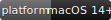
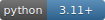
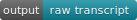

# Voice Flow

[](https://www.apple.com/macos/)
[](https://www.python.org/)
[](https://huggingface.co/mlx-community/Qwen3-ASR-1.7B-8bit)
[](#privacy)
[](#use)
[](LICENSE)

Local macOS dictation for Chinese and Chinese-English mixed speech.
Press `Page Down` to record, press it again to stop, then Voice Flow copies the
raw transcript and pastes it into the active text field.

## Install

Apple Silicon, macOS 14+, and Xcode Command Line Tools are required.

```bash
git clone https://github.com/songdc98/voice-flow-local-asr.git && \
  cd voice-flow-local-asr && ./scripts/install_macos.sh
```

On first launch, allow Microphone and Accessibility permissions. The model is
downloaded automatically on first use.

## Use

1. Open `Voice Flow.app` and leave it running in the Dock.
2. Click the input field where text should appear.
3. Press `Page Down` to start recording.
4. Press `Page Down` again to transcribe, copy, and paste.
5. Press `Page Up` when you only want to copy.

While recording, the small HUD shows level and elapsed time. System media is
muted and restored automatically. The default maximum recording time is 30
minutes. Only the three newest WAV files are kept.

## Privacy

Speech is processed locally with Qwen3-ASR. There is no cloud API, translation,
or LLM rewriting.

## License

MIT. See [LICENSE](LICENSE).
